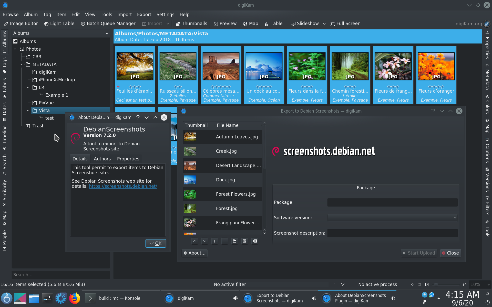

# Debian Screenshots

This experimental and legacy tool allows you to upload desktop captures to Debian documentation website.

# Dependencies

- Cmake 3.x.
- Qt5.
- ECM.
- KF5::KIO
- digiKam >-7.2 plugin interface. <https://www.digikam.org>

# Compiling and Installing

- mdkir build
- cd build
- cmake . -DCMAKE_INSTALL_PREFIX=/usr
- make
- make install/fast

